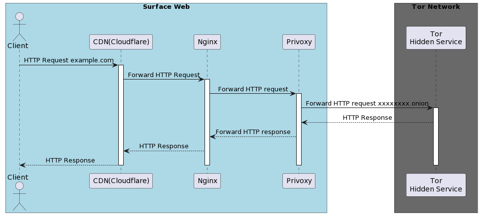

# kakurega
It's similar to Tor2Web, where accessing a domain name on the surface web proxies and displays a specified remote HiddenService. This is a Proof of Concept (PoC), and does not guarantee secure connections between HiddenServices.




## Requiremnets
- Docker
- Docker Compose
- Domain Name
- Backend Tor Hidden Service

## Quick Start
Replace SERVER_NAME and ONION_ADDRESS
```bash
docker run --rm --name s2onion -e SERVER_NAME=YourFront.example.com -e ONION_ADDRESS=YourBackend.onion -it -p 80:80 -d ghcr.io/39ff/kakurega:main
```

## (Optional) Host Machine iptables for Cloudflare
```
chmod +x setup_firewall.sh
./setup_firewall.sh cloudflare-range.txt
```

